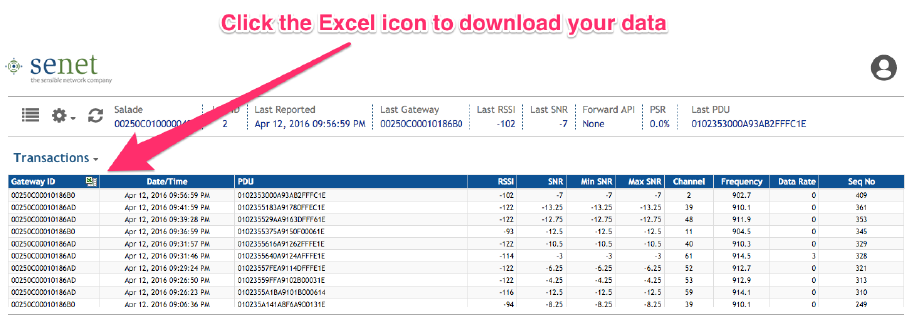
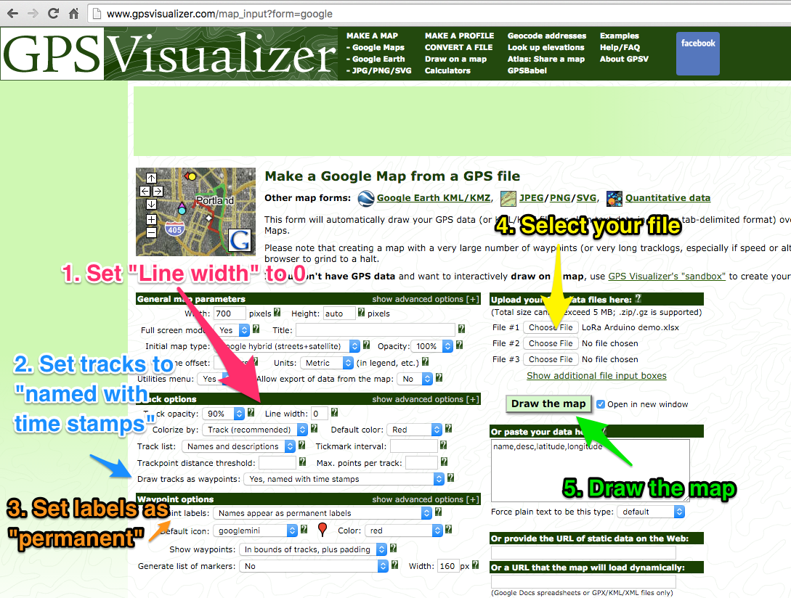
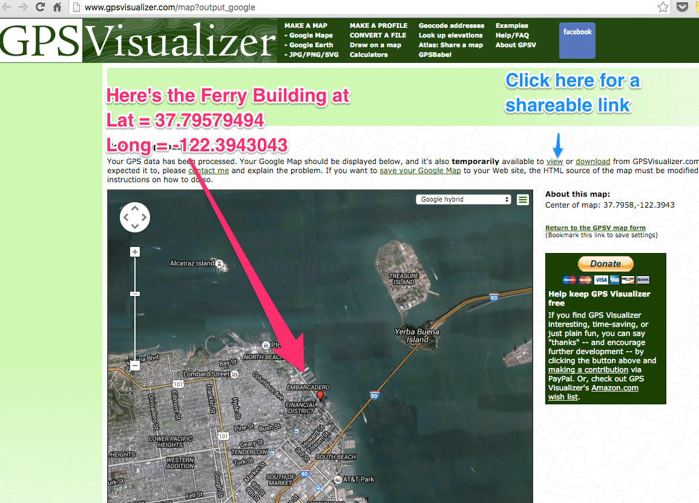

# LoRa-Arduino quickstart project

# Overview
###This project allows you to quickly try LoRa communications. 
**LoRa** is an exciting new technology for communicating at **Lo**ng **Ra**nge, low power, and low cost.  This project sends data from an Arduino Uno and a [Multitech mDot LoRa node](http://www.multitech.com/models/94557148LF) to the [Senet LoRa network](https://app.senetco.com/senetdev/login.aspx). Senet's JSON data payloads are converted by [Zapier](https://zapier.com) into data rows in a Google Spreadsheet. 

This project should take about an hour to complete, once you have the hardware.

This project was developed by the [Orange IoT Studio](http://orangeiotstudio.com/) to promote the consideration and adoption of LoRa. To that end, the IoT Studio is [supporting companies](http://orangeiotstudio.com/) interested in LoRa by giving out hardware kits and by funding co-development.  

### LoRa is great for IoT
LoRa is an ideal communications technology for many internet-of-things (IoT) devices because **internet connectivity** is a key feature of IoT while also one of IoT devices' the biggest burdens.  Specifically, pairing devices with WiFi or Bluetooth is tedious; cellular connectivity is easy to implement and can transmit megabytes (MB) of data, but it's often not affordable for simple IoT devices. That's where LoRa comes in. For simple IoT devices that only need to send kilobytes (KB) of data or less, LoRa is an ideal solution.  

Public LoRa networks are being deployed world wide, including by [Orange in France](http://www.orange.com/en/Press-and-medias/press-releases-2016/press-releases-2015/Orange-deploys-a-network-for-the-Internet-of-Things). This project uses the [Senet LoRa network](https://app.senetco.com/senetdev/login.aspx) in North America since it was developed by the [Orange IoT Studio](http://orangeiotstudio.com/), part of [Orange Silicon Valley](http://orangesv.com/) in San Francisco. 

### Project overview  
1. Get the hardware 
2. Get the software
3. Verify LoRa coverage
4. Configure the software
5. Assemble the hardware 
6. Test drive LoRa
7. Build on LoRa & promote your vision
 
### _Disclaimer_
_LoRa is a new technology and this project is in alpha, so it could break. If you're cool trying new things that aren't 100% reliable, proceed and have fun._   

## Get the hardware
You'll need to either purchase the equipment yourself or apply for a hardware kit from the IoT studio. 

### Apply for support from the IoT Studio
The IoT Studio is [supporting the developer community](http://orangeiotstudio.com/) to encourage use of LoRa.  You can apply for a free hardware kit containing the bill of materials, below. If you work for a company with a compelling use case, you can also apply for funded co-development.  The IoT Studio will be showcasing prototypes that demonstrate compelling LoRa use cases.

### Bill of Materials (BOM)
You need the basic equipment for the project and a set of sensors, either by LittleBits or by Sparkfun.  You'll need one (1) of each item below, unless otherwise noted. The prices are estimates.  

####Basic equipment  

* [Multitech mDot](http://www.digikey.com/product-search/en?mpart=MTDOT-915-X1P-SMA-1&v=591&v=881),  $60 
* [Arduino Uno](https://www.sparkfun.com/products/11021),  $25 
* [XBee shield](http://www.robotmesh.com/xbee-shield-v2-0),  $10   
* [Antenna for mDot](http://www.digikey.com/product-detail/en/multi-tech-systems/AN868-915A-10HRA/881-1242-ND/5246371), $10
* [USB Type-A cable](https://www.adafruit.com/products/62), $4
* [mDOT USB developer board](http://www.multitech.com/brands/micro-mdot-devkit), _??get link with price!_
* [Wires](https://www.adafruit.com/products/1956), $2 (you'll need 6 male-male wires)
* [Semtech NorAm mote LoRa network tester](http://www.semtech.com/images/datasheet/NorAmMote_User_Guide_3v0.2.pdf), _??get link with price!_	

####LittleBits sensors 
LittleBits sensors are easier to use, but more expensive.  If you prefer the something more affordable use the Adafruit sensors.

* [LittleBits Proto](https://littlebits.cc/bits/proto), $50 (you'll need 4 Protos at $12/piece)
* [LittleBits Fork](https://littlebits.cc/bits/fork), $12
* [LittleBits Sound trigger](http://littlebits.cc/bits/sound-trigger), $12
* [LittleBits Light sensor](http://littlebits.cc/bits/light-sensor), $12
* [LittleBits Button](http://littlebits.cc/bits/button), $8
* [LittleBits LED](http://littlebits.cc/bits/led), $8
 

#### Adafruit sensors 
Adafruit sensors require more work, but are more affordable. If you prefer something easier, use the LittleBits sensors.  
_Mike & Anna need to try this!!_

* [Breadboard](https://www.adafruit.com/products/64), $5
* [Sound trigger](??), _??get link with price!_ 
* [Light sensor - Photo transistor](https://www.adafruit.com/products/2831), $0.95
* [Tactile Button switch ](https://www.adafruit.com/products/367), $2.5
* [LED](https://www.adafruit.com/products/299), $4

## Get the software

### Create your accounts
You'll need to create accounts with the following websites to get this project to work.  

### Senet
[Senet](https://app.senetco.com/senetdev/login.aspx) provides a public LoRa network in North America. You'll need to create an account with Senet to view your data.  

  

### Zapier
[Zapier](https://zapier.com) automates the flow of data between Senet and Google Docs. For this project, we'll have Senet do an HTTP Post to a Zapier webhook. Zapier then puts the contents of Senet's JSON payload into a row in a Google Spreadsheet (gDocs). 

### Google Drive
You'll use [Google Spreadsheets](https://docs.google.com/spreadsheets/u/0/) to view and analyze your data in this project.

### mDot firmware
  
By default, the Multitech mDot is configured to communicate with AT commands at a 115200 baud rate. However, we found that errors happened between the mDot and the Arduino when they tried to communitacte that fast, so [here's firmware](assets/mDot_9600_baud.bin?raw=true)   with a slower 9600 baud rate, which works much better.  

### Arduino sketch
  
 You'll need the [Arduino IDE](https://www.arduino.cc/en/Main/Software) to configure your code.  [This sketch](assets/LoRa_Arduino_quickstart_April2016.ino?raw=true) was developed for an Arduino Uno on a MacBook to allow the Arduino to send data to the Multitech mDot using [AT commands](https://en.wikipedia.org/wiki/Hayes_command_set).  If you're using a different type of computer and have trouble getting the project to work, please [let us know](http://orangeiotstudio.com/). 

## Verify LoRa coverage 
[Senet](https://app.senetco.com/senetdev/login.aspx) provides a public LoRa network in North America and you'll need to verify where you have coverage. Specifically, there's a chance that you might not have coverage at your workbench, but that there's LoRa coverage in another part of your building or nearby. You can use [Semtech's NorAm LoRa Mote](http://www.semtech.com/images/datasheet/NorAmMote_User_Guide_3v0.2.pdf) to determine where you have coverage.  
  
In this quickstart project, the North American (NorAm) mote receives a GPS signal and sends it to Senet as a hexadecimal string.  We convert that string into latitude and longitude to view the exact location on a map. Senet refers to the data payload as a "packet data unit" (PDU). 

### Example
>Hexadecimal PDU payload from the NorAm mote: `010235C107A8F6CCFFFA14`  
>The latitude (lat) is hex encoded as: `35C107`  
>The longitude (long) is hex encoded as: `A8F6CC`  
>This converts to decimal lat, long: `37.79579494`, `-122.3943043` which is the [Ferry Building in San Francisco](https://www.google.com/maps/place/Ferry+Building/@37.7940467,-122.3962511,17z/data=!4m2!3m1!1s0x0000000000000000:0x6cf7a313d6a53ec7).     
  	 
### Send GPS data to Senet
Once you have the Semtech NorAm mote and a Senet account, you'll need to register the device with Senet so they know to send you its data.  To do this, you'll need to input the hexadecimal device ID (e.g., `00:25:0C:01:00:00:12:34`) and create a nickname for the device (e.g., `Boutargue`).  If you're using a NorAm mote from the IoT Studio, then it will come pre-loaded with the device ID and firmware to operate on the Senet network. If you purchased a NorAm mote, then you will need to [contact Senet](http://www.senetco.com/) to get firmware and a device ID.

The NorAm mote contains a battery so begin by charging it using a micro-USB cable in the `USB1` port.  The `CHG` light is red while the mote is charging and green when fully charged.  

Next, operate the NorAm mote turning the `ON/OFF` switch to `ON`. When the mote is `ON` it (1) searches for a GPS signal to determine its location and (2) tries to send the signal to the nearest Senet gateway.  While there's no GPS signal, the mote transmits a null packet `010200000000000000001E` which translates to lat, long: `0, 0`, which is the [Gulf of Guinea](https://www.google.com/maps/place/0%C2%B000'00.0%22N+0%C2%B000'00.0%22E/@6.1567252,-4.3467511,4.41z/data=!4m2!3m1!1s0x0:0x0).  If you receive any packet, **good news!**, you've got coverage!  If you receive a packet with data, even better, you can identify where exactly you have coverage.  

### Extract lat-long data

In the Senet portal, select your mote and click the Excel icon to download your data as a .csv file.  

The important part of the .csv file is **Column C**, which contains the **P**acket **D**ata **U**nit (for simplicity, this example ignores other columns of data).  Your .csv file should look like this:

| `Column A` | `Column B` | `Column C` | `Column D` |
|:---:|:---:|:---:|:---:|
| **Gateway EUI** | **UTC** | **PDU** | **...** |
|00250C00010186B0 | 4/13/16 2:56 | 010235C107A8F6CCFFFA14 | ... |

Use these formulas in Microsoft Excel or Google Spreadsheets to convert the hexadecimal payload to usable lat-long data: 

**Latitude**  `=(HEX2DEC(MID($C2,5,6))*90)/8388607`  
**Longitude**  `=(HEX2DEC(MID($C2,11,6))*180)/8388608-360`  
**Elevation** `=HEX2DEC(MID($C2,17,4))`  
**Transmit Power** (TxPow) `=HEX2DEC(MID($C2,21,2))`  

The file with formulas should look like this:

| `Column C` | `Column D` | `Column E` | `Column F`  |
|:---:|:---:|:---:|:---:|
| **PDU** | **Lat** | **Long** | **...** |
| 010235C107A8F6CCFFFA14 | 37.79579494 | -122.3943043 | ... |

Last, you'll take the lat-long data and plot it on a Google map so that it's easy to interpret.  First, copy-paste the lat-long data into its own spreadsheet.  The latitude data should be in Column A and longitude data in Column B.  Next, navigate to [GPS Visualizer for Google Maps](http://www.gpsvisualizer.com/map_input?form=google) and configure settings: 

1. Set "Line width" to 0
2. Set tracks to "named with time stamps"
3. Set labels as "permanent"
4. Select the file with your lat-long data
5. Click **`Draw the map`**
6. You can click on the `view` link to get a shareable link to your map. 

The file with just lat-long data should look like: 

| `Column A` | `Column B` |
|:---:|:---:| 
| Lat | Long |  
| 37.79579494 | -122.3943043 | 
| ... | ... |

   
## Configure the software

### mDot 
AT commands  
9600 baud  
Drag & Drop in MacBook. If Windows is different, please let us know how you loaded the mDot firmware and we'll update the instructions here. 

### Adruino Uno
You'll need the Arduino IDE. 

**You must customize your Arduino code so that it works with your mDot**

`/* AAA with ID ending in 11:22 */     const String mDot_name = "AAA"; const String Network_key =  "11:22:33:44:55:11:22:33:44:55:11:22:33:44:11:22"; const String Network_ID = "11:22:33:44:55";` 

*show cassis and how we labeled the mDot and tied the device # to the name*

These two files allow an Arduino to communicate via LoRa.  To reduce the dynamic memory of this sketch, reduce or remove the text in the Serial.print() statements.  The .ino file is for the Arduino.  The .bin file is for the Multitech mDot LoRa node. The sketch gathers sensor data to demonstrate *LoRa* by indicating activities in the kitchen: 
 1. Click. Count how many times users click a button. 
 2. Sound. Count how many times there's a loud noise.  
 3. Light. Meausre the average light level. 

## Assemble the hardware 
Plug stuff in to match the photo

## Test drive LoRa
Power up and run it!
Let us know that it worked

## Build on LoRa, Promote your vision
We hope that you'll use this project 
Share your experience -- we're featuring the most interesting projects on our website.

## Acknolwedgements

Mike Vladimer & Anna Aflalo developed this project at the [Orange IoT Studio](http://orangeiotstudio.com), part of [Orange Silicon Valley](http://www.orangesv.com/). We welcome feedback -- you can contact us via twitter: [@orangeiotstudio](https://twitter.com/orangeiotstudio), 
 [@mikevladimer](https://twitter.com/mikevladimer) & [@anna_aflalo](https://twitter.com/anna_aflalo).  
**Thanks to** Dave Kjendal & Shaun Nelson @ Senet, Joe Knapp @ Semtech. 
 
April 2016 

