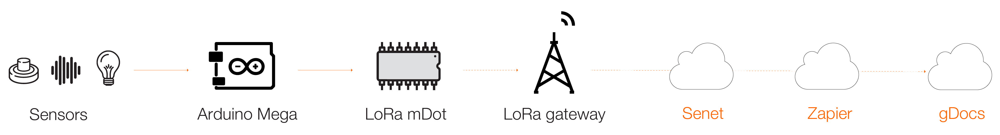
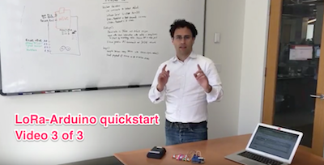

# LoRa-Arduino quickstart project

# Overview
###This project allows you to quickly try LoRa communications. 
#### Duration: This is a 3-hour project   

**LoRa** is an exciting new technology for communicating at **Lo**ng **Ra**nge, low power, and low cost.  This project uses an Arduino Uno and a [Multitech mDot LoRa node](http://www.multitech.com/models/94557148LF) to send data to the [Senet LoRa network](https://portal.senetco.com/).  Senet provides the gateways to receive the LoRa signal; [Zapier](https://zapier.com) and  Google Spreadsheets provide the rest of the software. 

This project was developed by the [Orange IoT Studio](http://orangeiotstudio.com/) to promote the adoption of LoRa. To that end, the IoT Studio is [supporting companies](http://orangeiotstudio.com/) interested in LoRa by donating hardware kits and by funding co-development.  

  

  

  

  

### LoRa is great for IoT
LoRa is an ideal communications technology for many internet-of-things (IoT) devices because **internet connectivity** is a key feature of IoT while also one of IoT devices' the biggest pain points.  Specifically, pairing devices with WiFi or Bluetooth is tedious; cellular connectivity is easy to implement and can transmit megabytes (MB) of data, but it's often not affordable for simple IoT devices. That's where LoRa comes in. For simple IoT devices that only need to send kilobytes (KB) of data or less, LoRa is an ideal solution.  

Public LoRa networks are being deployed world wide, including by [Orange in France](http://www.orange.com/en/Press-and-medias/press-releases-2016/press-releases-2015/Orange-deploys-a-network-for-the-Internet-of-Things). This project uses the [Senet LoRa network](https://portal.senetco.com/) in North America since it was developed by the [Orange IoT Studio](http://orangeiotstudio.com/), part of [Orange Silicon Valley](http://orangesv.com/) in San Francisco. 

### Project overview  
1. [Get the hardware](1_GetHardware.md) 
2. [Create your accounts](2_CreateAccounts.md) 
3. [Verify LoRa coverage](3_LoRaCoverage.md) 
4. [Configure the software](4_ConfigureSoftware.md) 
5. [Assemble the hardware](5_AssembleHardware.md) 
6. [Test drive LoRa](6_TestLoRa.md) 
7. [Build on LoRa & promote your vision](7_TheEnd.md) 

### Skills you need

* Basic programming experience
* Familiarity with Arduino
 
### _Disclaimer_
_LoRa is a new technology and this project is in alpha, so it could break. If you're cool trying new things that aren't 100% reliable, proceed and have fun._   

### Nomeclature
Since this project is at the cutting-edge of LoRa, many of the terms are new, so we've defined them here:

* `Network_ID` is the term used in the Arduino sketch that is your specific account ID with Senet.  It's also referred to as `Application`, `Application ID`, `APPEUI` and `reverse_APPEUI`.  
* `ID number` is the term used in the Arduino sketch that is the ID number for your device on the Senet network.  For mDot's, it's the ID number written on the device; for Semtech NorAm motes, it's the ID number you get from the Orange IoT Studio or you generate in ARM mbed. It's also referred to as `Device ID`, `DEVEUI` and `reverse_DEVEUI`.
* `Network_key` is the term used in the Arduino sketch that is the encoded key for your device on the Senet network. It's also referred to as `Device App Key`, `App Key` and `DEVKEY`.

### Start tutorial   
1. [Get the hardware](1_GetHardware.md) 

## Acknolwedgements

[Mike Vladimer](https://twitter.com/mikevladimer) & [Anna Aflalo](https://twitter.com/anna_aflalo) developed this project at the [Orange IoT Studio](http://orangeiotstudio.com), part of [Orange Silicon Valley](http://www.orangesv.com/). We welcome feedback -- you can contact us via twitter: [@orangeiotstudio](https://twitter.com/orangeiotstudio), 
 [@mikevladimer](https://twitter.com/mikevladimer) & [@anna_aflalo](https://twitter.com/anna_aflalo).  
A hat tip :tophat: and thanks to Dave Kjendal & Shaun Nelson @ Senet, Joe Knapp @ Semtech. 
 
April 2016 

