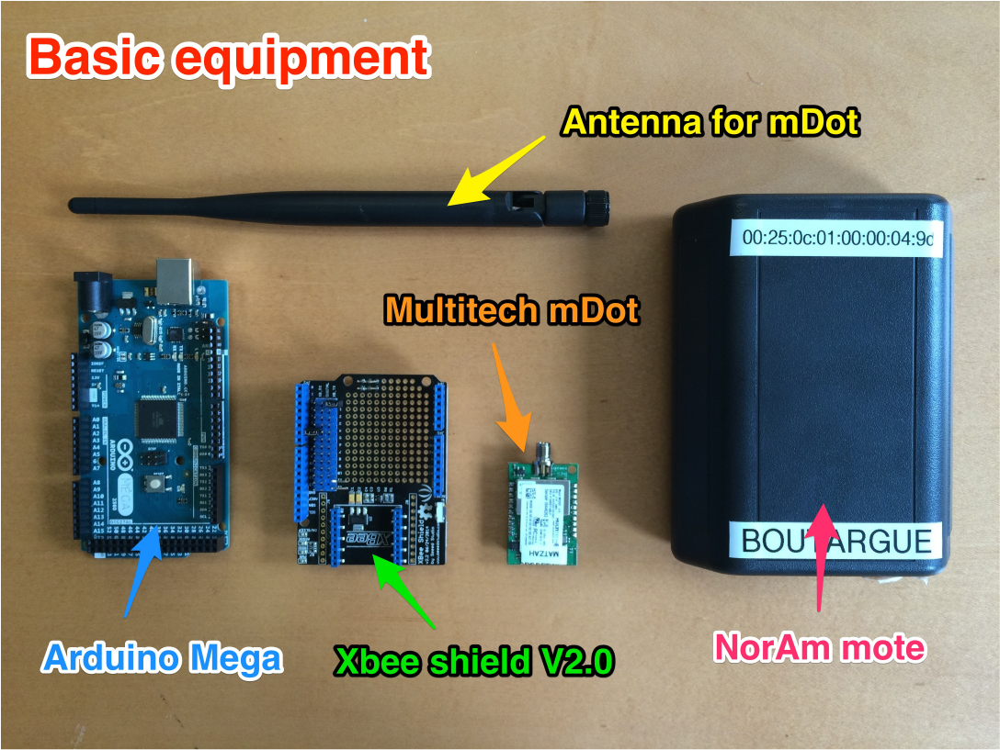
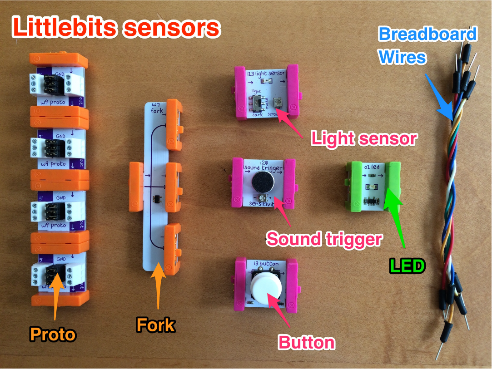
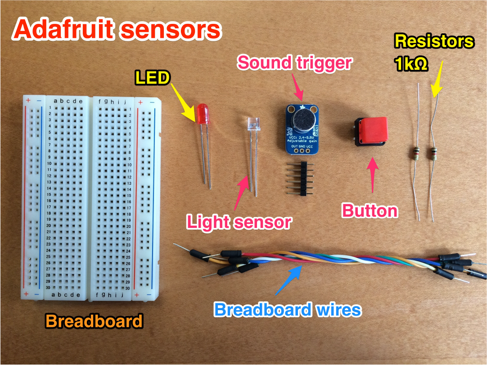

# 1. Get the hardware TEST
You'll need to either apply for a hardware kit from the IoT studio or purchase the equipment yourself. 

## Apply for support from the IoT Studio
The IoT Studio is supporting the developer community through its engagement program to encourage use of LoRa - fill in this [1 minute application](http://orangeiotstudio.com/).  You can apply for a free hardware kit containing the bill of materials, below. If you work for a company with a compelling use case, you can also apply for funded co-development.  The IoT Studio will be showcasing prototypes that demonstrate compelling LoRa use cases.

## Bill of Materials (BOM)
You need the basic equipment for the project and a set of sensors, either by LittleBits or by Adafruit.  You'll need one (1) of each item below, unless otherwise noted. The prices are estimates.  _Note that the XBee shield is only used as a physical interface between the mDot and the Arduino. This project does not use XBee communications._

###Basic equipment  
About $200  
You'll need these components regardless of which type of sensors you choose, LittleBits or Adafruit. 

* [mDot](http://www.digikey.com/product-search/en?mpart=MTDOT-915-X1P-SMA-1&v=591&v=881),  $60 
* [Antenna for mDot](http://www.digikey.com/product-detail/en/multi-tech-systems/AN868-915A-10HRA/881-1242-ND/5246371), $10
* [Arduino Mega](https://www.sparkfun.com/products/11061),  $46 
* [XBee shield v2.0](http://www.robotmesh.com/xbee-shield-v2-0),  $10 (There are a few versions so be sure to get the [Seeed Studio version](http://www.seeedstudio.com/wiki/XBee_Shield_V2.0))  
* [USB A-B cable](https://www.adafruit.com/products/62), $4
* [Breadboard Wires](https://www.adafruit.com/products/1956), $2 (you'll need 6 male-male wires, 2 male-female wires)
* [mote](http://www.semtech.com/images/datasheet/NorAmMote_User_Guide_3v0.2.pdf), $100 Optional network tester _??get link from Senet_	 
* [Pre-configured gateway for $780]() _add link from senet_ or [non-configured gateway for $300](http://www.semiconductorstore.com/cart/pc/viewPrd.asp?idproduct=50688), if you get the non-configured gateway, you'll need to configure it using Senet's website.  

###LittleBits sensors 
About $100  
LittleBits sensors are easier to use, but more expensive.  If you prefer the something more affordable use the Adafruit sensors.  

* [LittleBits Proto](https://littlebits.cc/bits/proto), $50 (you'll need 4 Protos at $12/piece)
* [LittleBits Fork](https://littlebits.cc/bits/fork), $12
* [LittleBits Sound trigger](http://littlebits.cc/bits/sound-trigger), $12
* [LittleBits Light sensor](http://littlebits.cc/bits/light-sensor), $12
* [LittleBits Button](http://littlebits.cc/bits/button), $8
* [LittleBits LED](http://littlebits.cc/bits/led), $8   

 

### Adafruit sensors 
About $20  
Adafruit sensors require more work, but are more affordable. If you prefer something easier, use the LittleBits sensors.  

* [Breadboard](https://www.adafruit.com/products/64), $5
* [Sound trigger - Microphone Amplifier](https://www.adafruit.com/product/1063), $7 
* [Light sensor - Photo transistor](https://www.adafruit.com/products/2831), $1
* [Tactile Button switch ](https://www.adafruit.com/products/367), $3
* [LED](https://www.adafruit.com/products/299), $4   
   

### Next tutorial  
2.[Create your accounts](2_CreateAccounts.md) 
