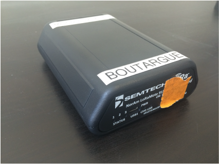
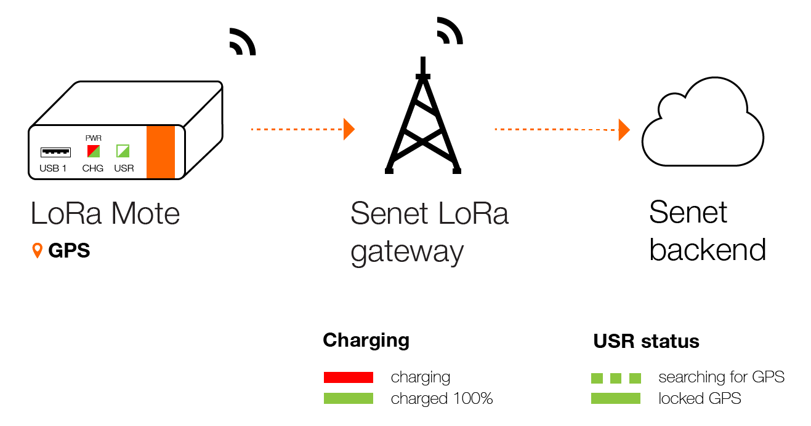
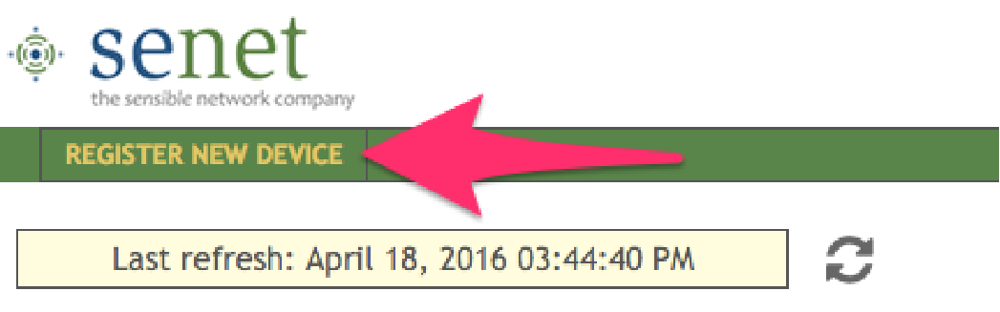
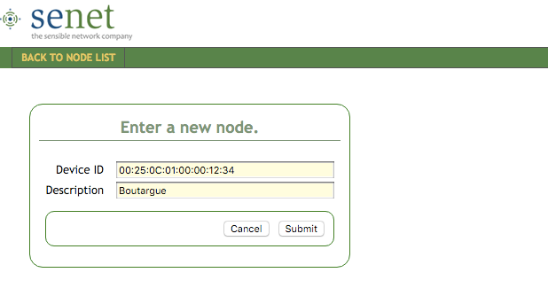
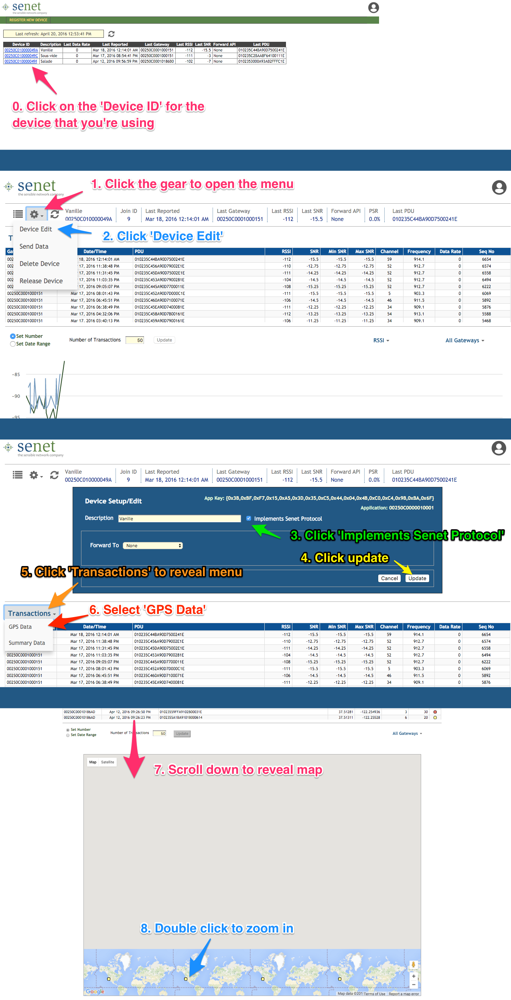

# 3. Verify LoRa coverage 
[Senet](https://portal.senetco.com/) provides a public LoRa network in North America and you'll need to verify where you have coverage. Specifically, you might not have coverage at your workbench, but you could find LoRa coverage in another part of your building or nearby. You can use [Semtech's NorAm LoRa Mote](http://www.semtech.com/images/datasheet/NorAmMote_User_Guide_3v0.2.pdf) to determine where you have coverage.  
  
In this quickstart project, the North American (NorAm) mote receives a GPS signal and sends its location to Senet as a hexadecimal data payload.  We convert that string into latitude and longitude (lat-long) data to view the exact location on a map. Senet refers to the data payload as a "packet data unit" (PDU). 

## Example
>Hexadecimal PDU payload from the NorAm mote: `010235C107A8F6CCFFFA14`  
>The latitude is hex encoded as: `35C107`  
>The longitude is hex encoded as: `A8F6CC`  
>This converts to decimal lat, long: `37.79579494`, `-122.3943043` which is the [Ferry Building in San Francisco](https://www.google.com/maps/place/Ferry+Building/@37.7940467,-122.3962511,17z/data=!4m2!3m1!1s0x0000000000000000:0x6cf7a313d6a53ec7).     
  	   	 

## The user interface for the mote
The NorAm mote contains a battery so you will need to charge it.  There are 2 micro-USB ports on the front of the mote, chage with the one labeled `USB1`.  The `CHG` light is orange while the mote is charging and green when fully charged. The `USR` light blinks green while the mote is searching for GPS and is solid green when it has locked the GPS signal.  You don't need to worry about lights `1` `2` and `3`. If you've got a mote from the IoT Studio, then the `USB2` port is covered with orange tape -- it's a port for updating the mote's firmware. 

## Get mote Device ID

If you're using a NorAm mote from the IoT Studio, then skip this step since your mote comes pre-loaded with the device ID and firmware to operate on the Senet network. 
 
If you purchased a NorAm mote, then you will need to load it:   
1. Download the firmware from here: [Senet NoRam Mote Network Coverage Test Tool on ARM mbed](https://developer.mbed.org/teams/Senet/code/Senet-NAMote/).   
2.  To build the program click “Import Library” to add a copy of the source code  to your developer workspace.
3. In the pop-up window select “saves as program”.   
4. Confirm and wait 2 to 3 minutes for the import to complete.     

Most importantly, you'll need to generate your own, unique device ID -- the wiki page describes how to do this. After you've customized your firmware, click compile to build and download the firmware (the .bin file).

You'll now need to upload the file to your Semtech NorAm mote. First, connect the USB1 port to a power source -- this port is only used for power.  Next connect the USB2 port to your computer -- this port is only used for communication.  The mote will appear as a USB storage device. Drag your .bin file to the mote and the firmware will install itself.  Disconnect the mote from your laptop. You're all set.
 
## Send GPS data to Senet
Now that you have the Semtech NorAm mote with the proper firmware, you'll need to register the device with Senet so they know to send its data to your account.  After you're logged into your Senet account, input the hexadecimal device ID (e.g., `00:25:0C:01:00:00:12:34`) and create a nickname for the device (e.g., `Boutargue`) in the window saying: _"You have no nodes. Please enter a node."_. If it isn't the first device you register on Senet, click on `REGISTER NEW DEVICE` and you will be able to add this new device.  

Charge the battery on the mote by connecting power `USB1` to power.  Next, operate the NorAm mote turning the `ON/OFF` switch to `ON`. When the mote is `ON` it (1) searches for a GPS signal to determine its location and (2) tries to send the signal to the nearest Senet gateway.  While there's no GPS signal, the mote transmits a null packet `010200000000000000001E` which translates to lat, long: `0, 0`, which is the [Gulf of Guinea](https://www.google.com/maps/place/0%C2%B000'00.0%22N+0%C2%B000'00.0%22E/@6.1567252,-4.3467511,4.41z/data=!4m2!3m1!1s0x0:0x0).  If you receive any null packets, **good news!**, you've got coverage.  If you receive a packet with data, even better, you can identify exactly where you have coverage.  

## Generate a map in the Senet portal
Once you've sent GPS data to Senet, navigate to the webpage with data for your device and follow the steps below to visualize the data in a map. Note that if you've only sent null packets (`010200000000000000001E`), there will not be anything to visualize. _(If you prefer, we've also detailed [how to do this manually](map_Senet_PDUs.md))_. 

1. Click the gear to open the drop-down menu
2. Click `Device Edit`
3. Click `Implements Senet Protocol`
4. Click `Update`
5. Click `Transactions` to reveal drop-down menu
6. Select `GPS Data`
7. Scroll down to reveal the map
8. Double-click on the map to zoom in to view the relevant data

 

### Next tutorial
4.[Configure the software](4_ConfigureSoftware.md) 
