# 6. Test drive LoRa   

The hardware is assembled. You still have a few steps to go but you're getting close!

1. Open the Arduino code. 
2. If you haven't already, ensure that you customize the code with your unique `Network_ID` and `Network_key`.
3. Use the USB Type A-B cable to connect the Arduino to your computer.   
4. Upload the code from your IDE to the Arduino.   
   a. In the 'Tools' tab, select the 'Arduino/Genuino Uno' board, and the port corresponding to your USB cable _(/dev/cu.usbmodem1411 for Mac)_     
   b. Open the `Serial Monitor` window in the IDE.    
   c. Select 115200 baud as a baude rate     
   d. Click on the `upload` arrow    
   e. Wait until it is 'Done uploading.'     
5. You can monitor the Arduino in the Serial Monitor window -- things are good when you see `Successfully joined the LoRa network.     
    Arduino is beginning to read the sensors and send data...`   
6. Play with your three sensors and check if the data comes through on your Senet account.    
   _Notice that the `time_threshold` is set at 900. The data will be sent every 15 minutes unless you click the button 10 times in a row._   
   
You're sending data via LoRa, congratulations!   
   
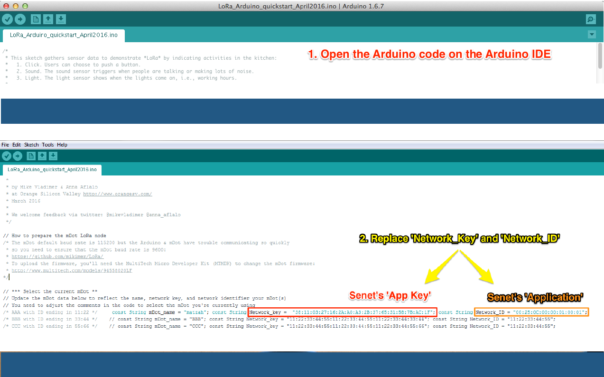    

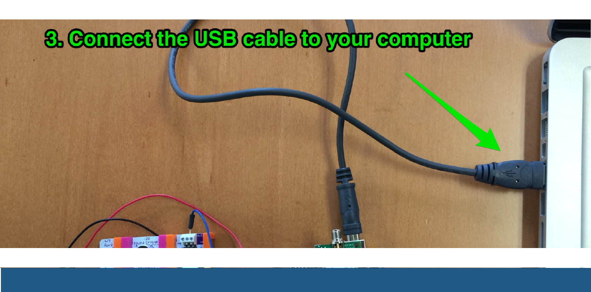   

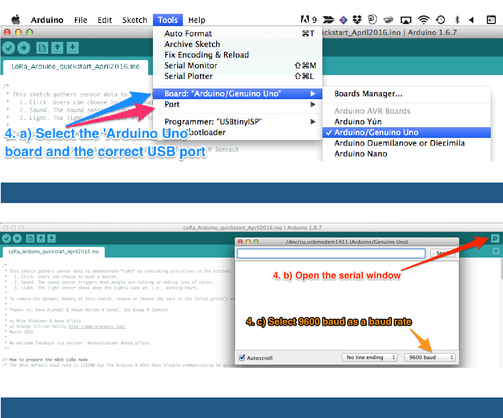   

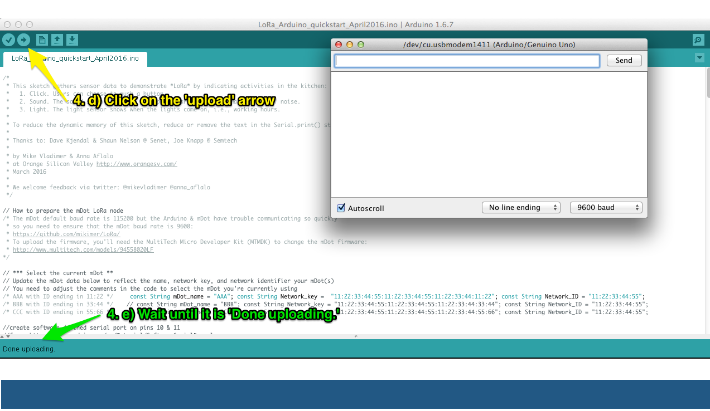   

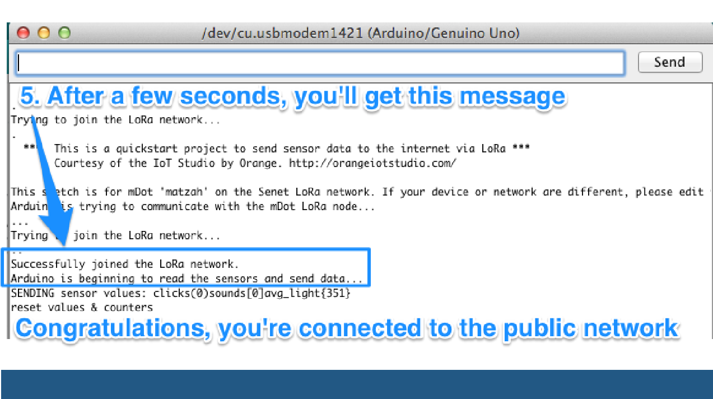   

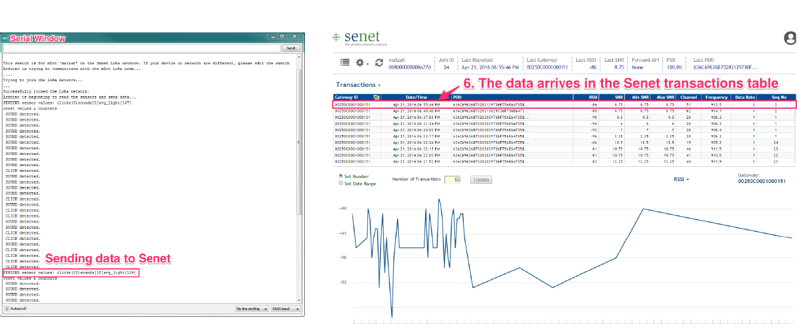  

## Debugging tips for LoRa connectivity
If you're having trouble getting this project to work, here are some steps you can take:

* If your mDot keeps joining and then failing to join the network, you're at the edge of your coverage. Move to another spot (probably closer to outdoors) where you can get consistent coverage.   
* If your mDot isn't sending data to the Senet LoRa network, validate that you have coverage by plugging in the mote.  If you don't receive data from the mote, then you probably won't be able to receive data from the mDot either.  You'll need to find a new location (which could be as close as the nearest window or as far as miles away) where you get coverage.

## Send data from Senet via Zapier to a Google Spreadsheet
Once you're sending data to Senet, the final step is to get the data into a Google Sheet for easy analysis.  We'll now connect **Senet, Zapier, and gDocs** so that Senet sends a JSON payload to Zapier; then Zapier copies the payload into a column in a Google Sheet. In your browser, you'll need to **keep tabs open to all three websites**.

**Start by making a Google Sheet**  
Create a new Google Sheet and name it something like `LoRa Arduino Awesome Sheet`. Copy these column headers and paste them into the Sheet:  
`Date/Time`, 	`PDU`, 	`Time PT`, 	`Mins past midnight`, 	`Click`, 	`Sound`, 	`Light`, 	`decoded PDU in ASCII`, 	`0`, 	`2`   

_These column headers are formatted so that you can easily copy-paste them into gDocs without manipulation._ 

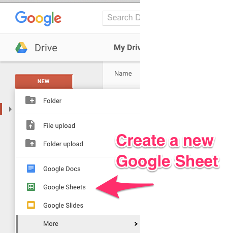  

  

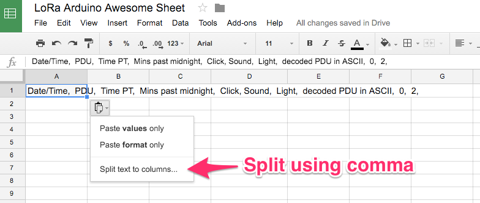  

**Switch from gDocs to Zapier**  
Now that your gDoc Sheet is ready, you can prepare your zap. We start with the `Trigger`.

1. In Zapier, click `Make a Zap`. 
2. Name your Zap something like `LoRa Arduino super Zap`.
3. In the trigger search bar, type `webhook` and select `Webhooks by Zapier`. 
4. Select `Catch Hook`.
5. In `Pick off a child key (optional)` just click `Continue` to skip this step.
6. Click `Copy to clipboard` to copy the the Zapier webhook URL.

  

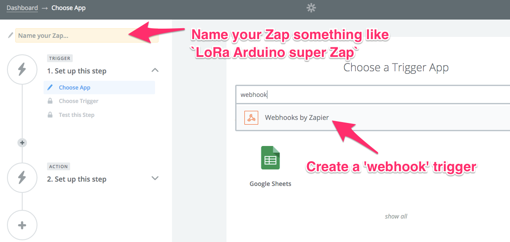  

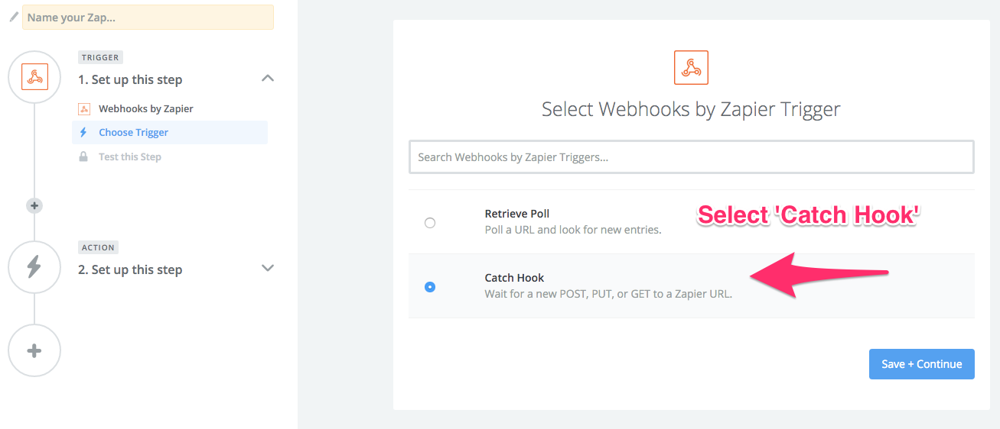  

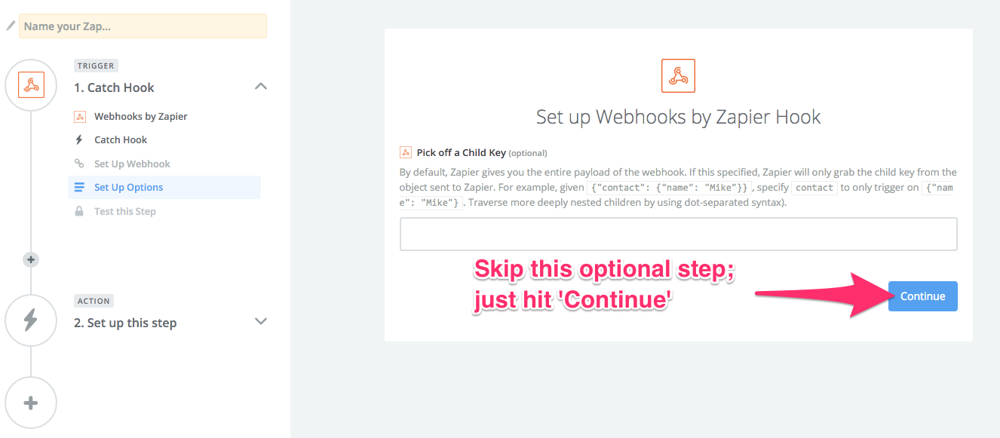  

  

**Switch from Zapier to Senet**  
You've created the Zapier webhook that will receive the JSON payload from Senet.  Switch from the Zapier tab to the Senet tab -- continue to keep both tabs open. In the Senet portal:

1. Navigate to the `Device Setup/Edit` window for your mDot.
2. Open the `Forward To` drop-down menu and select `HTTPS Post`.
3. Paste the webhook URL from Zapier.
4. Click `Update`.

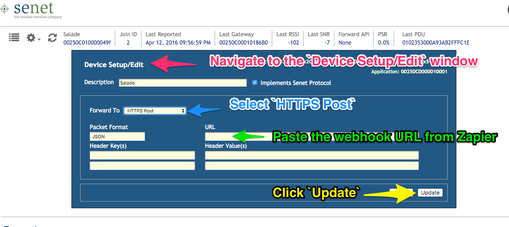  

**Confirm that you're sending data to Senet, then switch to Zapier**   
Senet will now send a copy of the mDot's payload to Zapier, including the PDU. **Make sure that your Arduino is sending data so that Senet delivers data to Zapier.**  To do this, click the sensor button 10 times and then wait 15 seconds -- you should see a new data payload arrive in the Senet portal. (*The Arduino sketch automatically sends data every 15 minutes or if a user clicks the button 10 times -- this is the external button on port A3, not the reset button on the Arduino board itself.*)   
  

Zapier must recieve at least one JSON payload at the webhook in order to know what to expect for key-value pairs.  Switch back to the Zapier tab.  In Zapier, click `Ok, I did this` and Zapier will look for JSON payloads from Senet.  Now we'll configure the zap's `Action` in Google Sheets:  

1. Select `Google Sheets` as your Action App.
2. Click `Create a Row`, then `Save + Continue`.
3. Grant permission for Zapier to interact with your Google Sheets account, then `Save + Continue`. 
4. Connect the Google Sheet columns to the parts of the JSON payload coming into the webhook:
  a. Select your `Sheet`.
  b. Select your `Worksheet`.
  c. Connect the Google Sheet column `datetime` to the in-coming webhook payload `Txtime`.
  d. Connect the Google Sheet column `pdu` to the in-coming webhook payload `Pdu`.
  e. Click `Continue`. 
5. Click `Create & Continue`. 
6. Click `Finish`.  
7. Finally, turn your zap `ON`! 

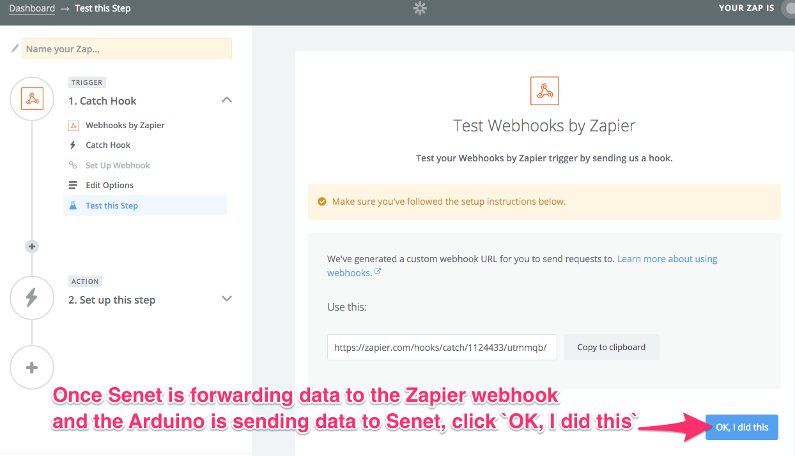  

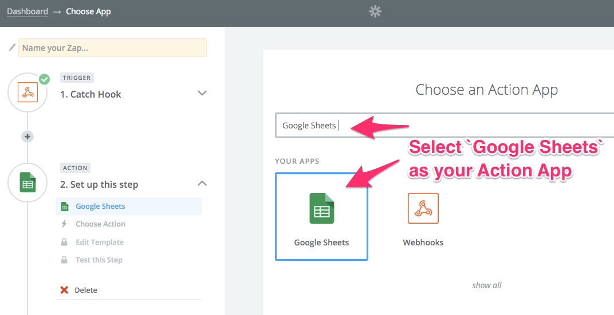  

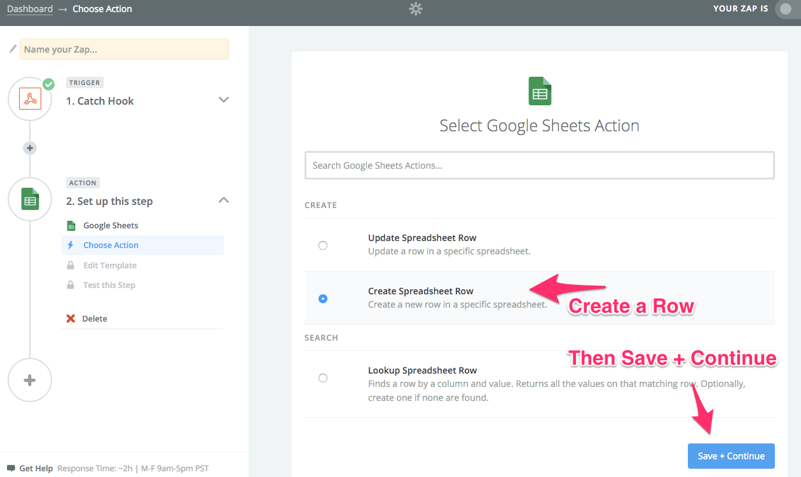  

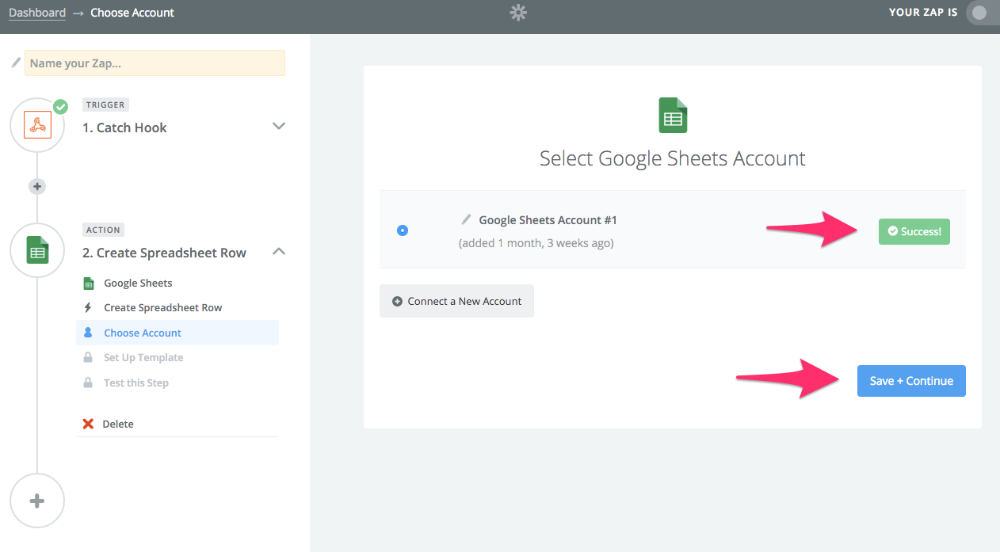  

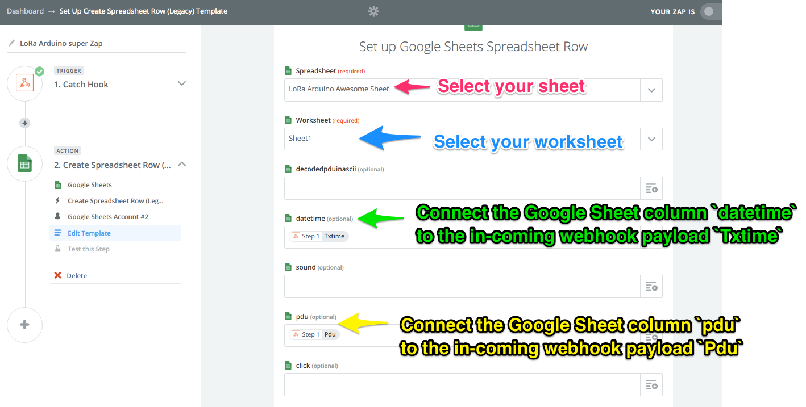  

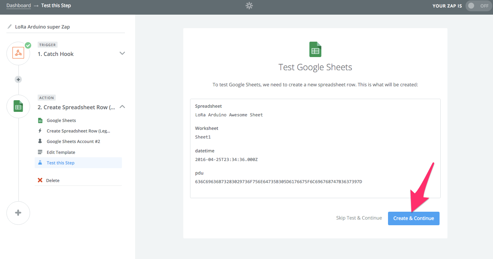  

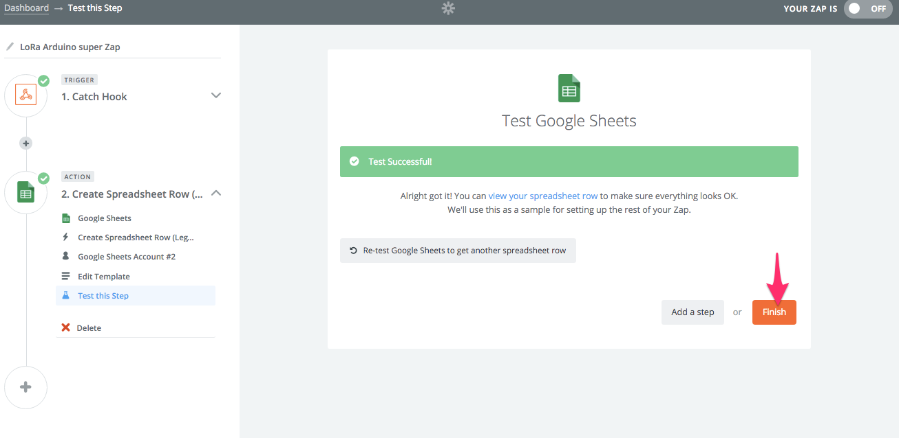  

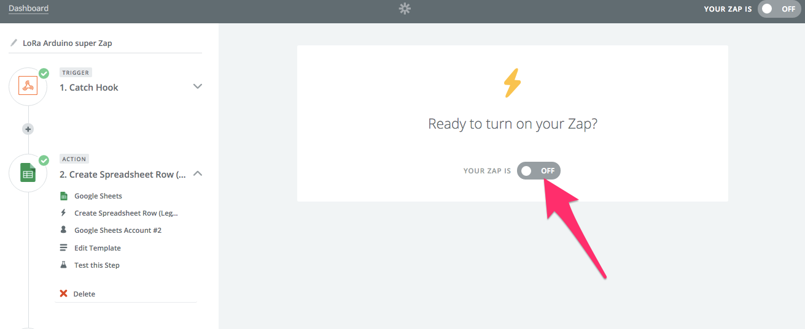  

**Switch from Zapier to gDocs**  
Switch from the Zapier tab to the Google Sheet tab to see the results of the integration. Zapier is now automatically posting data into Column A, `Date/Time` and Column B, `PDU`.  We'll now add formulas to **Row 3** of the Sheet to decode the PDU:   

Find the **formulas** on this [template](https://docs.google.com/spreadsheets/d/1SyGVlMp_O3UY1SqvRneCFR7j2sqjy8ZmX5fIZr2ulGI/edit#gid=0).  

The following lines will explain specifically what the formulas do:  

Column C - **Time PT**    
`=CONCATENATE( mod(left(right($A3,8),2)+17,24),":", right(left(right($A3,8),5),2))`  
*The `17` in this formula corresponds to Pacific Time (PT) in San Francisco. You can adjust this value for your timezone -- for instance, `20` corresponds to Eastern Time (ET) in New York City.*

Column D - **Mins past midnight**   
`=60*mod(left(right($A3,8),2)+17,24)+ right(left(right($A3,8),5),2)`  
_We use this metric to more easily visualize data when we graph it._  

Column E - **Click**   
`=REGEXEXTRACT(H3,"\(([0-9]+)\)")`  
_This formula uses the contents of **Column H**, so don't be alarmed if there's an error when Column H is empty. is a count of how many times users clicked the button._

Column F - **Sound**   
`=REGEXEXTRACT(H3,"\[([0-9]+)\]")`  
_This formula uses the contents of **Column H**, so don't be alarmed if there's an error when Column H is empty.  This is a count of how many loud noises (impulses) happened._

Column G - **Light**   
`=REGEXEXTRACT(H3,"\{([0-9]+)\}")/10`  
_This formula uses the contents of **Column H**, so don't be alarmed if there's an error when Column H is empty.  This is the average light level. The Arduino measures this for just 1 second every 15 minutes._

Column H - **decoded PDU in ASCII**     
`=CONCATENATE(I3:BA3)`  

Column I - **decoded first PDU byte**    
`=if(I$1<len($B3), char(hex2dec(left(REPLACE($B3,1,I$1,""),2))), " ")`    
*This formula converts the first PDU byte to ASCII text.*

Column J - **decoded second PDU byte** 
`=if(J$1<len($B3), char(hex2dec(left(REPLACE($B3,1,J$1,""),2))), " ")`  

Columns K to AR  - **decoded PDU bytes**      
Each column analyzes one byte of the PDU string. We're using the [ASCII table](http://www.asciitable.com/) in order to translate the PDU (numerical representation) into characters (readable data).  These formulas rely on numbers in **Row 1** incrementing by 2: 0, 2, 4, 6...  

* Change the contents of cell `J1` from the value `2` to the formula `=i1+2`.  
* Copy-paste that formula out from cells `J1` to `AR1`.
* Now in **Row 3** copy-paste the formula from cells `J3` to `AR3`. 
   
   
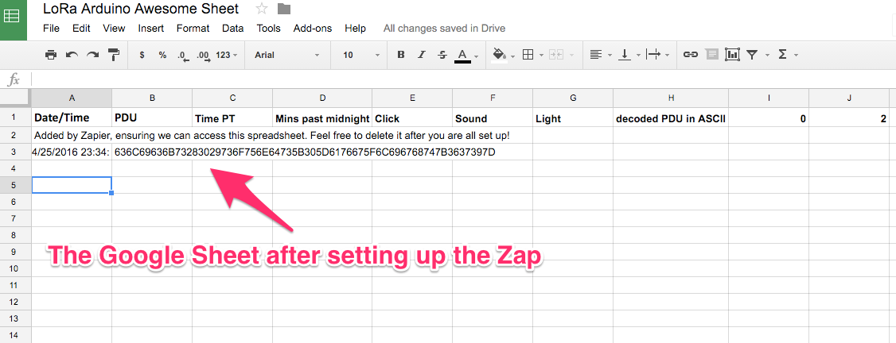  

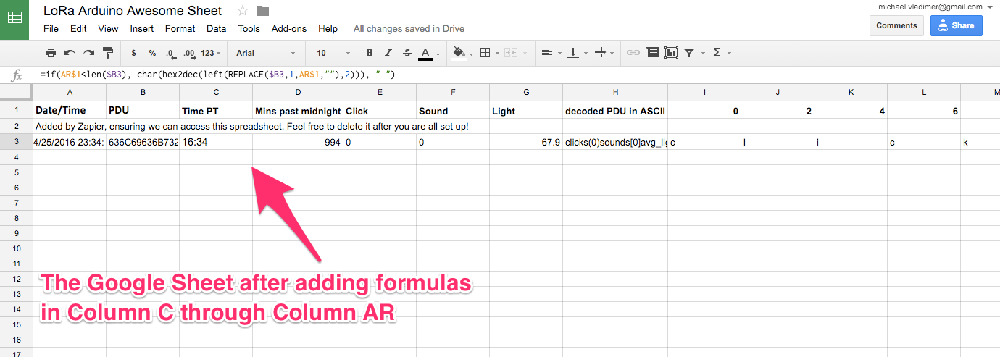  

### Next tutorial
7.[Build on LoRa & promote your vision](7_TheEnd.md) 
